# ECE444 lab 5: TDD
### Student Name: Yihang Lin

## First Test

#### Hello world at localhost:5001
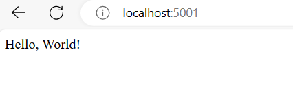

#### Pytest Passed
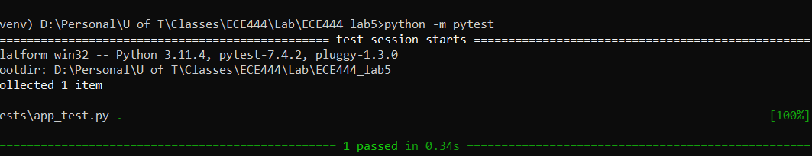

## Database Setup
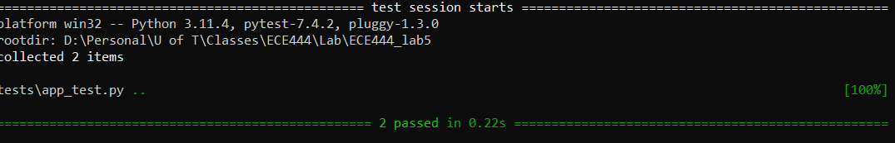

## Template and Views
#### pytest result
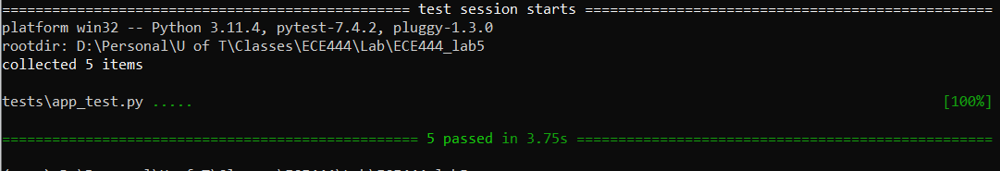

## Add Some Style
#### Added a post
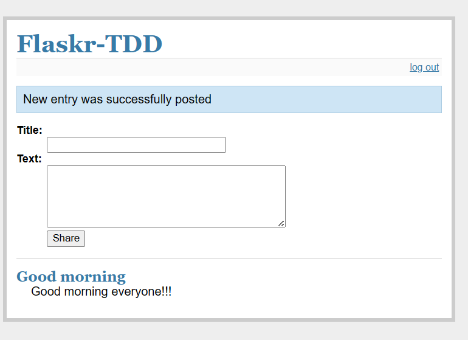

#### Logged out
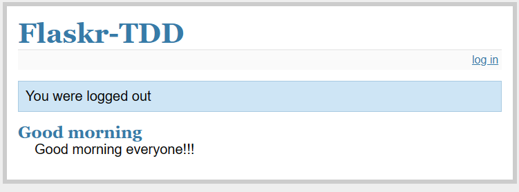

## JavaScript (Part)
#### Two Comments
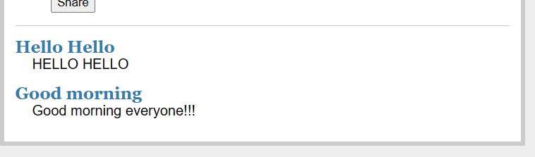

#### Deleted a comment
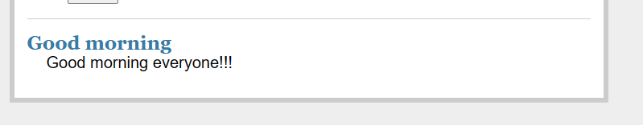

#### Pytest Result
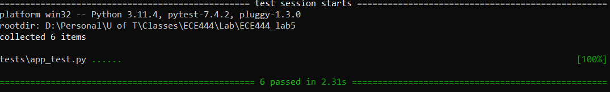

## Bootstrap
#### New UI
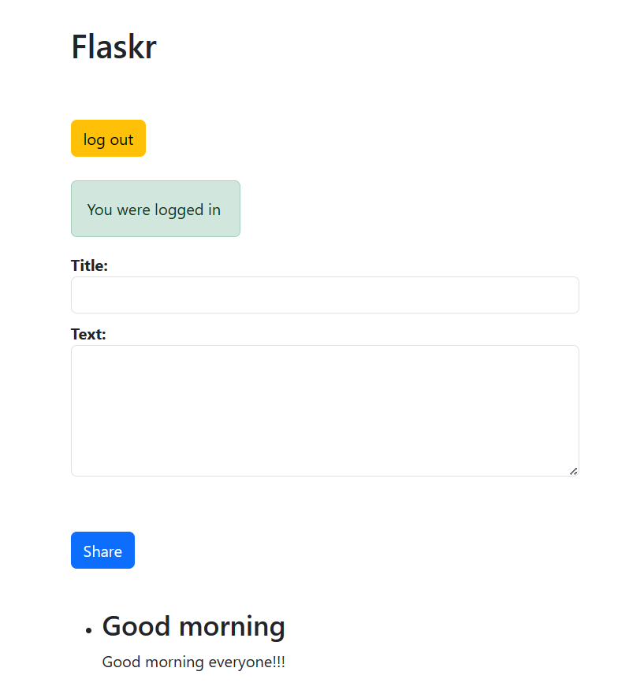

## SQLAlchemy
#### Passing all Pytest
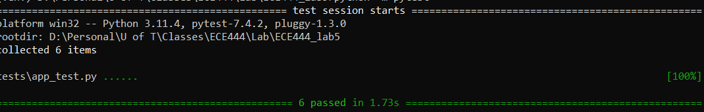

## Search Page
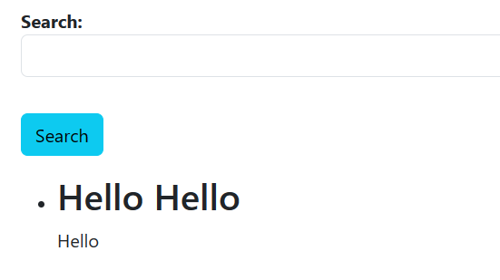

## Login Restriction
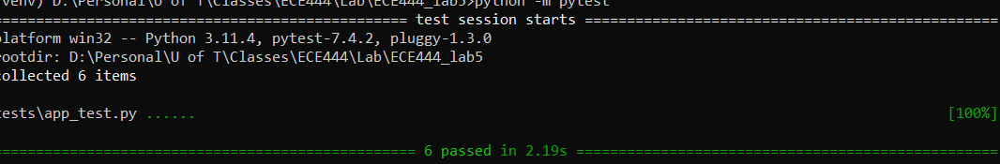